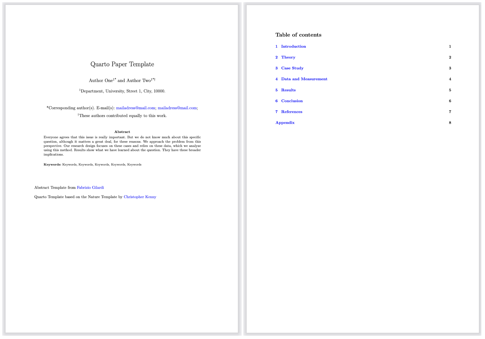
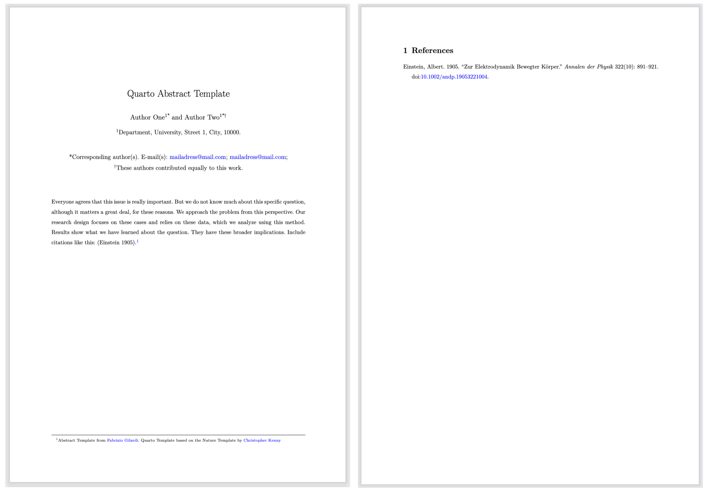
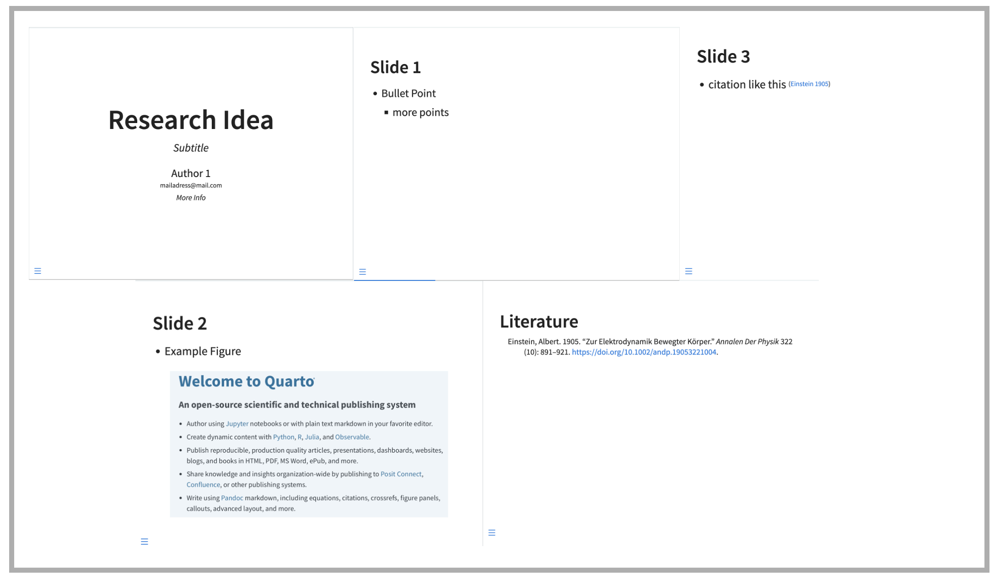
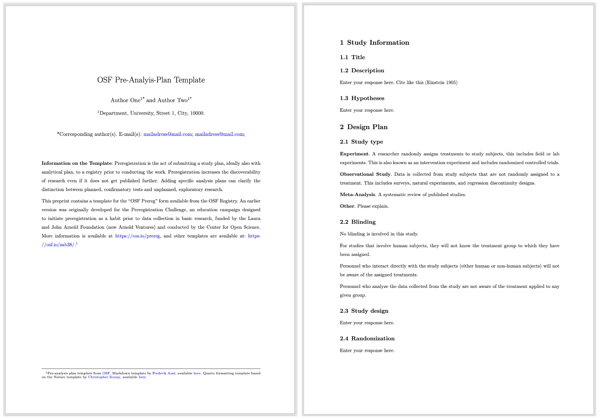

<h1> Academic Writing with Quarto</h1>

This template provides researchers with a project structure that supports an integrated, reproducible, and transparent writing process with [Quarto](https://quarto.org). `academicwriting` consolidates Quarto templates for academic articles, abstracts, pre-analysis plans, conference presentations, and R&R memos, keeping all files in a clean, organized structure. If you’ve ever struggled to streamline your projects, this may help.

The basic idea of `academicwriting` is to provide a comprehensive framework for writing research articles, consolidating all necessary components into a single repository. By organizing all data wrangling, analysis, and writing in one place, this framework ensures that (1) every part of the research project references the same data and literature—allowing for streamlined analysis and a more efficient writing process—and (2) co-authors and readers can clearly understand the processes behind the project.

The templates also include writing guides and best-practice examples to support both the technical and substantive aspects of writing. :dizzy:

The template synthesizes work from other researchers. The paper and abstract Quarto templates are adapted from [Christopher Kenny’s](https://christophertkenny.com) template, available [here](https://github.com/christopherkenny/nature). The abstract features a wording template by [Fabrizio Gilardi](https://fabriziogilardi.org), available [here](https://fabriziogilardi.org/resources/papers/good-abstracts.pdf). The pre-analysis template is from [OSF](https://osf.io), available [here](https://docs.google.com/document/d/1gkN0Jp6Gu7GIA4Ne4YCDZ61nCLQRgt32moRdUg9AnVg/edit?tab=t.0#heading=h.fwbi14d4b65g).

In the sub-sections in this README are detailed instructions for all specific templates within the `academicwriting` framework.

## What You Need to Use This

To use this template, you should have:

-   [TinyTeX](https://yihui.org/tinytex/) installed
-   [Quarto](https://quarto.org/docs/get-started/) installed

## The Structure

The basic idea of `academicwriting` is that all parts of the writing process reference the same data, figures, and literature. Reference files are stored in the folders `_bibliography`, `_data`, and `_figures`. Templates for specific outputs within a research project (e.g., a pre-analysis plan) are stored in separate folders. See [Figure 1](#figure-1) for an organizational chart of the repository.

### Data

This folder stores all relevant data. The `input` folder contains all raw files, while the `output` folder is for files that have already been processed or analyzed.

-   /data
    -   /input
    -   /output

### Wrangling

This folder is for scripts used during the data wrangling process. The template includes an example R script.

-   /wrangling
    -   /example_script.R

### Bibliography

This folder stores all the literature you reference in your project. I recommend connecting Zotero (with the Better BibTeX extension) to this folder, which will automatically export all citations.

-   /bibliography
    -   /bib.bib

### Figures

This folder stores all figures you create.

-   /figures
    -   /example_figure.png

### Paper

This folder contains the Nature article [template](https://github.com/christopherkenny/nature) by [Christopher Kenny](https://christophertkenny.com). The template is slightly modified with a "parent" file, `paper.qmd`, that stores the YAML and all metadata. Rendering this produces the PDF. All sections are in the subdirectory `/sections` under individual QMD files to keep the writing process organized without one super long QMD file.

-   /paper
    -   /paper.qmd (This is the core file. Rendering this produces the PDF.)
    -   /sections (This is where you write the different sections.)
        -   /introduction.qmd
        -   /theory.qmd
        -   /casestudy.qmd
        -   /methods.qmd
        -   /results.qmd
        -   /conclusion.qmd
        -   /appendix.qmd
    -   /extensions (Stores TeX files for formatting)

The output will then look like this: 

### Abstract

-   /abstract
    -   /abstract.qmd (This is the core file. Rendering this produces the PDF)
    -   /extensions (Stores TeX files for formatting)

The output will then look like this: 

### Presentation

-   /presentation -/presentation.qmd (Core File. Rendering this produces the HTML Slides)

The output will then look like this: 

### Pre-Analysis Plan

-   /pap
    -   /pap.qmd (This is the core file. Rendering this produces the PDF)
    -   /extensions (Stores TeX files for formatting)

The output will then look like this: 
