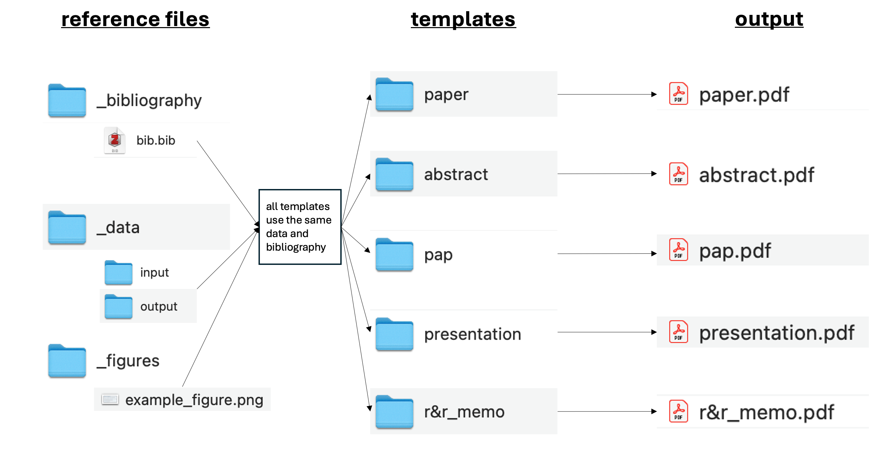
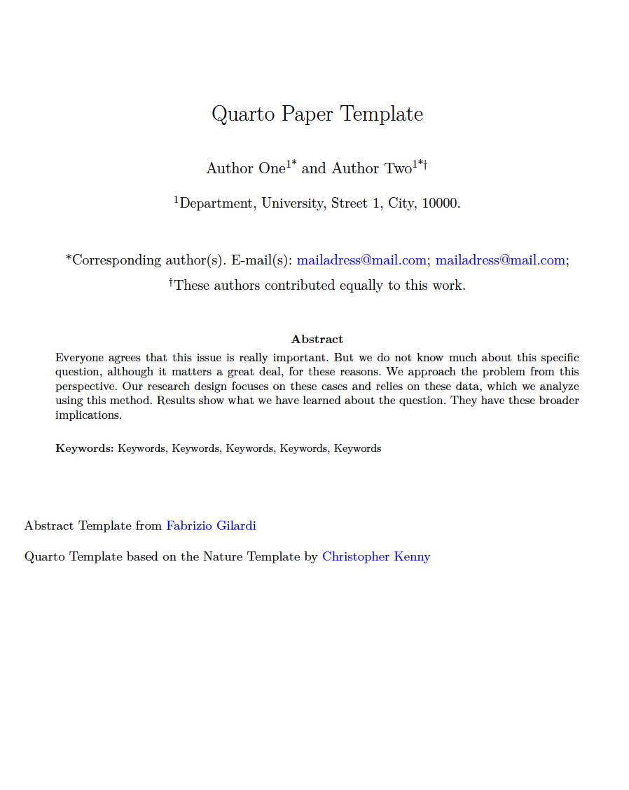
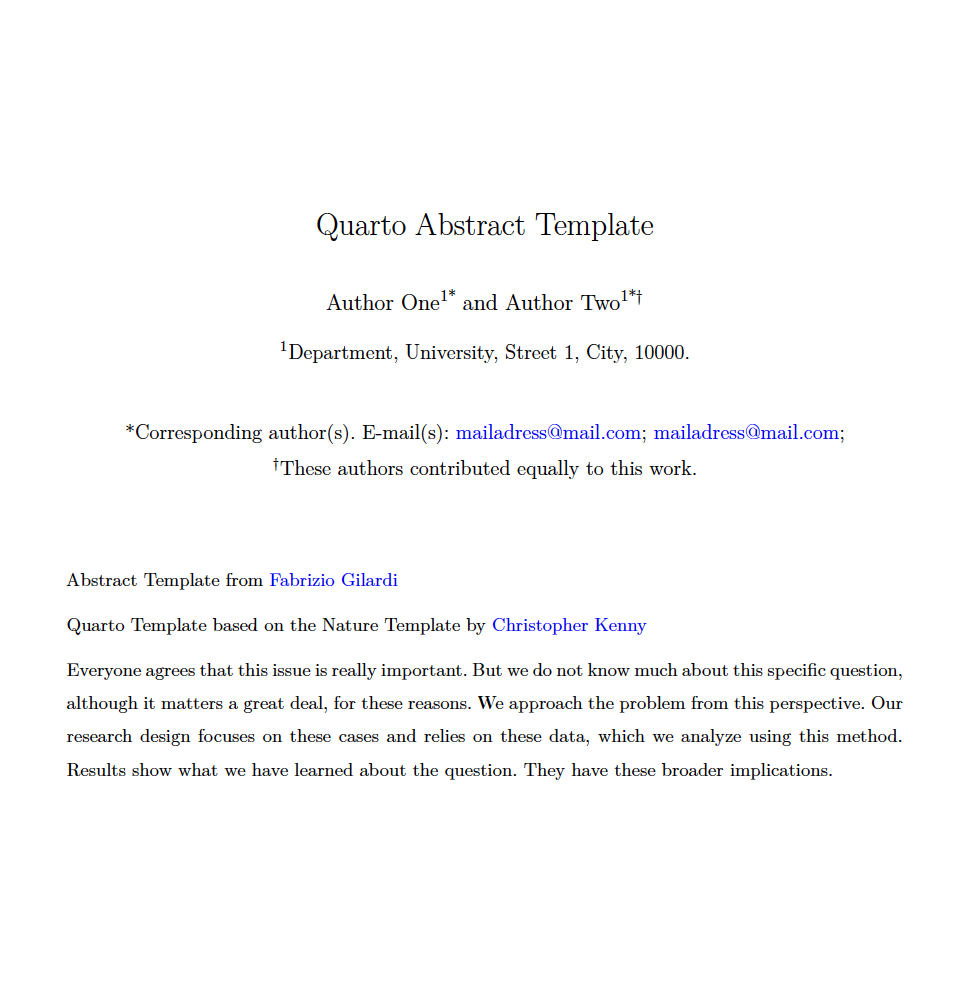
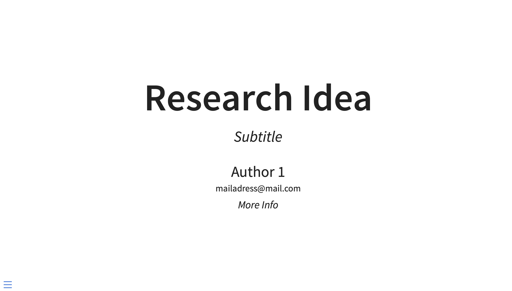

# Academic Writing with Quarto :page_with_curl:

This template aims to provide researchers with a project structure that allows for an integrated, reproducible, and transparent writing process. It provides Quarto templates for academic articles, abstracts, pre-analysis plans, conference presentations, and R&R memos. It helps by keeping all files in a clean, organized file structure. If you have ever struggled with streamlining your projects, this might help you as well!

The goal is to provide a comprehensive framework for writing a quantitative article, consolidating all necessary components into a single project. By organizing all writing and analysis in one place, this framework ensures that every part of the project references the same data, allowing for streamlined analysis and a more efficient writing process. In practical terms, this means that all work within a project—such as the paper manuscript, conference presentations, R&R memos, and pre-registrations—relies on the same data and bibliography files. This allows you to easily adapt your work across all outputs, resulting in an integrated, transparent research process.

Aside from the technical framework, the templates also include guides on writing and best-practice examples for the specific output products. This should help you with both the technical and substantive parts of writing! :dizzy:

The template synthesizes work and templates from other researchers. Credit for this goes to these authors, cited in the respective files.

## Templates

1.  A PDF article based on the template by [Christopher Kenny](https://github.com/christopherkenny/nature)
    -   The Guide on writing in this is from [Macartan Humphreys](https://macartan.github.io/teaching/how-to-write)
2.  A PDF abstract based on the template by [Fabrizio Gilardi](https://fabriziogilardi.org/resources/papers/good-abstracts.pdf)
3.  An HTML presentation (for conferences)
4.  A memo for replying to revisions and resubmissions (R&Rs)

## What You Need to Use This

To use this template effectively, you should have:

-   Basic coding skills in R and Markdown
-   [TinyTeX](https://yihui.org/tinytex/) installed
-   [Quarto](https://quarto.org/docs/get-started/) installed

## The Structure

### Data

This folder stores all relevant data. The `input` folder contains all raw files, while the `output` folder is for files that have already been processed or analyzed.

-   /data
    -   /input
    -   /output

### Wrangling

This folder is for scripts used during the data wrangling process. The template includes an example R script.

-   /wrangling
    -   /example_script.R

### Bibliography

This folder stores all the literature you reference in your project. I recommend connecting Zotero (with the Better BibTeX extension) to this folder, which will automatically export all citations.

-   /bibliography
    -   /bib.bib

### Figures

This folder stores all figures you create.

-   /figures
    -   /example_figure.png

### Paper

This folder contains the template by Christopher Kenny for writing an academic article. The format is a slightly modified Nature style.

-   /paper
    -   /paper.qmd (This is the core file. Rendering this produces the PDF.)
    -   /sections (This is where you write the different sections.)
        -   /introduction.qmd
        -   /theory.qmd
        -   /casestudy.qmd
        -   /methods.qmd
        -   /results.qmd
        -   /conclusion.qmd
        -   /appendix.qmd
    -   /extensions (Stores TeX files for formatting)

The output will then look like this: 

### Abstract

-   /abstract
    -   /abstract.qmd (This is the core file. Rendering this produces the PDF)
    -   /extensions (Stores TeX files for formatting)

The output will then look like this:\

### Presentation

-   /presentation -/presentation.qmd (Core File. Rendering this produces the HTML Slides)

The output will then look like this: 
